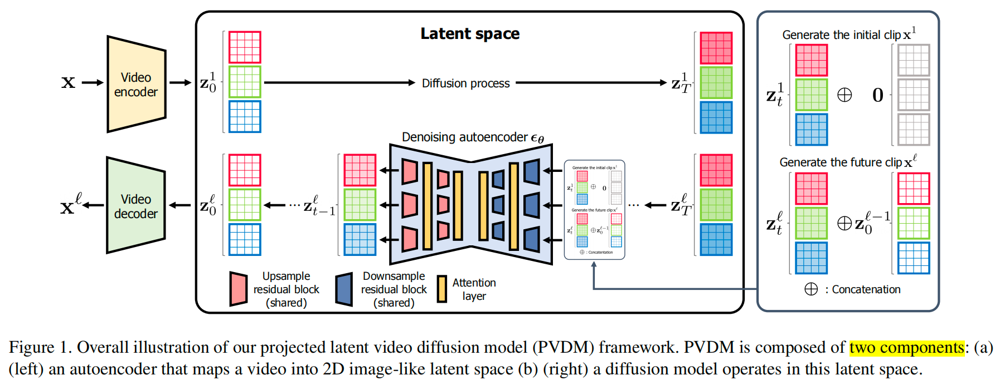
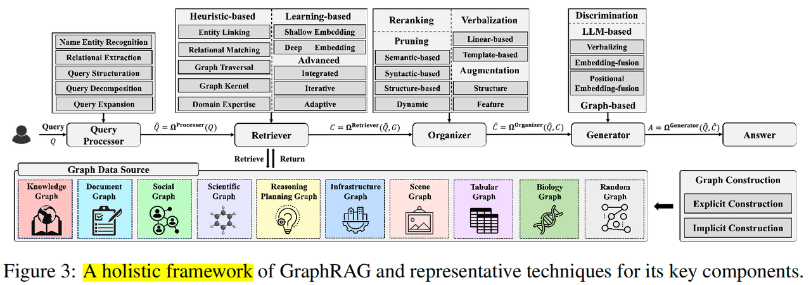

# 2025.5

## 5.13
《Tune-A-Video: One-Shot Tuning of Image Diffusion Models for Text-to-Video Generation》
2023.3 腾讯和NUS的一篇工作，内容要点：
1，T2V generation model，依赖在 extensive video data 上训练，非常消耗资源，本文希望复用T2I model的成果，通过轻量级解决方案来达到比较好的效果
2，Turn-a-video 的方案分成两步：model finetuning，通过在 T2I diffusion model 上引入 ST-attention，在 one pair data上tune model，让其学会捕捉 temporal consistency by querying relevant positions in previous frames
3，第二步：在 inference 阶段，通过基于 DDIM inversion 的 latent noise of source video 作为 input 和 guidance 信息，从而让模型能够保持 input video 的 structure
4，从实验结果来看，其视频编辑结果相比 CogVideo 和 Plug-and-play 都要更好
5，本文的方法可以被用在 Object editing，Background change，Style transfer，Personalized and controllable generation 等领域

《Language model beats diffusion: tokenizer is key to visual generation》
2024.3 Google和CMU的一篇文章，内容要点：
1，主要论述一个好的 visual tokenizer 带来的好处；传统上，LLMs 在image/video generation任务上表现不好，原因在于缺少 good visual representation，本文第一次验证 LLM 在imagenet benchmark上 beat diffusion model，with a good visual tokenizer
2，从实验结果看，在使用 MGAVIT-v2 video tokenizer的情况下，相应MLM模型的 video generation, video compression, video understanding 对比其他方法都取得很好的效果
3，结合这个 tokenizer，LLMs outperform diffusion model 在 ImageNet/Kinetics 等image/video generation benchmarks上；在 video compression 和 action recognition 上表现也更好，对比 previous top-performing video tokenizer

## 2025.5.11
《Zero-shot Image-to-Image Translation》

文章要点：
1，本文聚焦 image translation（也就是图像编辑问题），提出了 pix2pix-zero 方法

2，实现方法，本质上相当于在 denoise 过程中，在 cross-attention 机制依赖的 text embedding 上，加入了 edit text 这个方向向量，这样通过 cross attention guidance 就可以保持原有结构

3，效果上，本文方法在image quality和content preservation方面 outperform 了 SDEdit 和 prompt-to-prompt
本文提出方法，在保留原始image内容框架的基础上，引入 specific text editing，思路很新颖，效果很不错。

《Pix2Video: Video Editing using Image Diffusion》

文章要点：

1，本文研究 text-guided video editing 问题，挑战在于achieve the target edits while preserve the content of the source video（balance）

2，image diffusion models do image generation good, quality and diversity. 本文研究用such pre-trained models for text-guided video editing

3，pix2video，基于pretrained and fixed diffusion model，training free 的方法。通过 manipulate the internal features of diffusion model along with additional guidance constraints

4，实验结果，Pix2Video is on par or superior to baselines while not requiring additional pre-processing or finetuning

## 2025.5.7

《Make Pixels Dance: High-Dynamic Video Generation》

文章要点：

    1. Existing video generation model, Limited to generate simple scenes, tend to produce video clips with minimal motions

    2. 当前已有的方法通过 proposed the use of highly descriptive text 来对视频生成做更好的控制，然而detailed text不仅costly，也难以学习，model 需要 significantly scale up

    3. 生成long video，有两种方法：**Autoregressive method** 和 **Hierarchical method**，PixelDance，采用的是 autogressive method 思路，展现出了 a remarkable capability to generate high-quality videos in these out-of-domain categories（科幻、动漫等)

    总体上，是非常好的一篇文章，以一种比较优雅的方式，实现了高质量、灵活的 video 生成

## 2025.5.6

《DreamBooth: Fine Tuning Text-to-Image Diffusion Models for Subject-Driven Generation》

文章要点：

    1. 有一类 image generation 问题，是对图像中 subject 尽量保持不变，**改变其风格/背景等** ，包括 recontextualization, modification of subject properties such as material and species, art rendition, and viewpoint modification 等

    2. 当前 text-to-image model 缺少 preserve the subject's key features and synthesize images of the subject's contextualized in different scenes 的能力，主要原因是，模型output的表达能力受限，不能准确的 reconstruct given subjects 的外观，都只是创建它们的变体

    3. 本文目标，given a few images of a subject，**implant the subject** into the output domain of the model（Pre-trained, diffusion-based text-to-image framework）so that it can be synthesized with a unique identifier（prompt）

《Video Probabilistic Diffusion Models in Projected Latent Space》

文章要点：

    1. Video generation 的特点：High resolution, high dimensionality；temporal coherent, temporal dynamic；Large spatial variations

2. 本文的核心想法，是将 given video parameterize 到一个2D latent space中，再训练 diffusion model，以此降低 video 模型训练和推理的复杂度，同时保持比较好的生成效果
3. PVDM（ *projected latent video diffusion model* ）， **the first latent diffusion model designed for video synthesis** , 主要包含2个部分：autoencoder，encode 3D video pixels as three succinct 2D latent vectors，把视频映射到低维空间；Diffusion model

 

## 2025.5.5

《**Retrieval-Augmented Generation with Graphs (GraphRAG)**》

本文要点：

1. 本文是一篇综述性文章，提供一个comprehensive and up-to-date review of GraphRAG to unify the GraphRAG framework from the global perspective
2. RAG 是一个 powerful tech 加强下游任务，通过retrieve additional info，而Graph 是一个包含了massive信息的 nodes 和 edges的集合，**这让它成为一个 golden resource for RAG；**比较缺少 a systematic and up-to-date survey of GraphRAG's key concepts and techniques
3. GraphRAG offers unique advantages in **capturing relational knowledge** by leveraging graph-based machine learning (e.g., Graph Neural Networks (GNNs)) and graph/network analysis techniques (e.g., Graph Traversal  Search and Community Detection)；拥有复杂结构的 graph，需要设计 **dedicated graph encoder** with appropriate expressiveness to capture structural nuances

