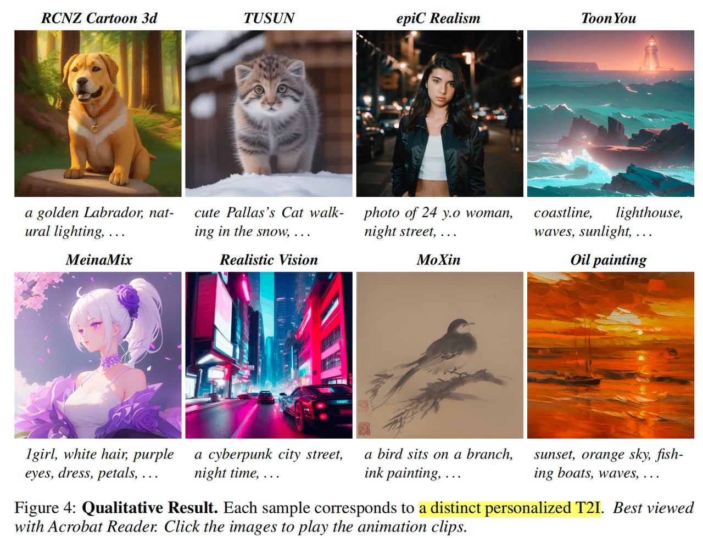
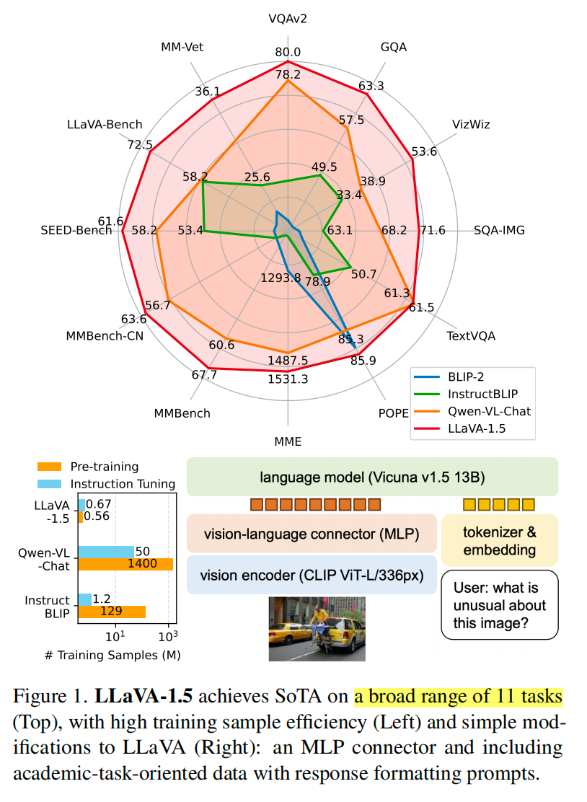
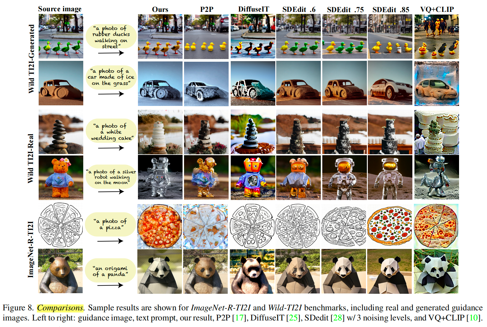
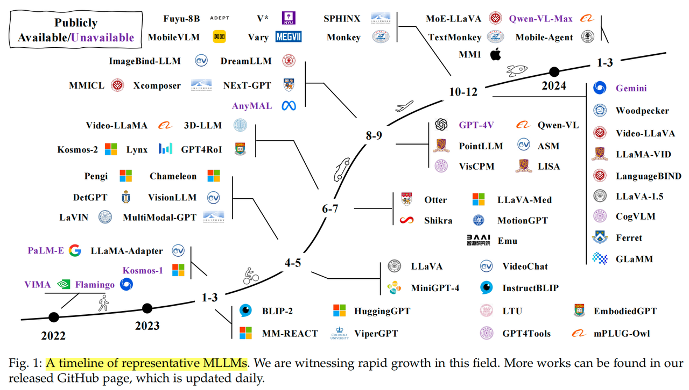

# 2025.6

## 6.2
《AnimateDiff: Animate Your Personalized Text-to-Image Diffusion Models without Specific Tuning》
2024.2 香港中文大学，SAIL，Stanford 合作的一篇文章，内容要点：
1，本文研究在 T2I diff model的基础上，如何生成动态内容。这是一个比较难的问题
2，本文设计了 AnimateDiff，an effective pipeline for addressing the problem of animating personalized T2Is while preserving their visual quality and domain knowledge. 可以和 ControlNet/T2i-Adapter 等结合起来，实现 controllable animation generation
3，从结果来看，还是比较不错的

# 2025.5

## 5.21
《Text2Video-Zero: Text-to-Image Diffusion Models are Zero-Shot Video Generators》
2023.3 PAIR 的一篇文章，T2I 和 T2V 相关，内容要点：
1，由于 text-to-image 的发展，表现出 great image quality，大家希望 exploit text-to-image models for video generation
2，本文提出 Text2Video-Zero，不需要做额外训练，Zero shot text-to-video generation，主要对T2I model有2个改进，latent codes of the generated frames with motion dynamics，以及Cross-frame attention of each frame on the first frame
3，T2V-Zero 可用于 text-to-video 合成，conbined with ControlNet/DreamBooth Generate Conditional and context-specialized video generation，以及 Video instruct-pix2pix 用于视频编辑

## 5.19
《Imagen Video: HIGH DEFINITION VIDEO GENERATION WITH DIFFUSION MODELS》
2022.10 Google 的一篇 video generation文章，内容要点
1，推出了 Imagen Video 方法，基于 VDM 和 SSR, TSR 等，实现了 text-to-video high fidelity 生成
2，通过 FID,FVD,CLIP 等指标做评估，能看出来具有 scaling up 效应
3，从生成效果上看，还是听不多的，在生成内容多样性，以及 temporal 一致性上都还不错，不过画面变动幅度并不大

总体上，属于 Imagen 这篇文章的 video 版本，同样的cascaded框架。

《ControlVideo: Training-free Controllable Text-to-Video Generation》
2023.5 Huawei 和哈工大的一篇文章，内容要点：
1，Video generation 发展遇到的问题有，Image diffusion generation model 很成功，但是video模型遇到 excessive cost of tempral modeling；Appearance inconsistency and structural flickers, especially in long video synthesis
2，本文目标：consistent and efficient video generation。基于 ControlNet，提出了 ControlVideo model，引入了3个核心机制：fully cross-frame interaction，Interleaved-frame smoother，a hierarchical sampler
3，从实验结果来看，相比其它同时期的 model，ControlVideo 无论在生成内容质量（appearance and structure consistency）上，以及推理速度上，都有比较好的表现。

## 5.18
《ControlNet: Adding Conditional Control to Text-to-Image Diffusion Models》
2023.11 Stanford 的一篇影响比较大的工作，内容要点
1，本文提出 ControlNet arch，可以在 large pretrained T2I diffusion model 的基础上，learn conditional control
2，实验结果显示，ControlNet 可以有效控制SD with single or multiple conditions，with or without prompts
3，Spatial control conditions：edges, depth, segmentation, human pose

## 5.17
《Control-A-Video: Controllable Text-to-Video Diffusion Models with Motion Prior and Reward Feedback Learning》
2024年中大的一篇文章，内容要点
1，本文目标提出了一个 controllable T2V framework for generating videos based on text prompts and control maps. Generate higher-quality, more consitent videos compared to existing SOTA methods in controllable text-to-video generation
2，方法上，基于LDMs 和 ControlNet，extra trainable motion layers applied to UNet and ControlNet for temporal modeling，有几个改进点：noise manipulation（control map, content prior） to enhance temporal consistency，训练时结合ST-ReFT reward
3，总体上，本文基于 diffusion model，用到了 content prior、motion prior等信息加强 temporal consistency，训练时结合ST-ReFT。应用场景上可用于控制视频生成，也可以用来做 video editing

《LLaVA 1.5: Improved Baselines with Visual Instruction Tuning》
2023.10 Microsoft 的一篇文章，LLaVA model的后续，内容要点
1，本文起源于 LLaVA，从 the perspectives of the input, model, and data systematic 研究 LMM 的design choices，在一个 controlled setting 下
2，本文发现 improve V-L connector to two-layer MLP can improve LLaVA's multimodal capabilities；在scale up 的影响方面，scale data, resolution, connector, model size 几个点都有作用；scale up image resolution 可以减少幻觉
3，LLaVA 是最简单的 LMM 架构之一，训练量少，并且在VQA，MME/SEED 等数据集上都表现出SOTA的性能。本文基于LLaVA，研究模型的一些 scale up 要素，有比较多有价值的结论，最终得到升级版模型 LLaVA 1.5

《Prompt-to-Prompt Image Editing with Cross Attention Control 》
2022.8 Google Research 的一篇文章，内容要点
1，本文研究 image editing 问题，提供了一种方法，在基本保持 spatial layout 的基础上实现 text-driven editing
2，Text-driven model generate High diverse images follow given texts，然而它们比较难用于 text-driven image editing，因为 even a small modification of the text prompt 可以导致一个完全不同的 outcome；当前的SOTA做法，比如让user提供masked region
3，本文 dive deep 分析 text-conditioned model，发现 cross-attention layers 是控制 spatial layout of the image to each word of prompt 之间 relation 的关键要素。在T2I model中 cross-attention 的强大能力
4，提出 prompt-to-prompt editing framework，edits完全被texts control。不需要依赖 model training, fine-tuning, extra-data or something.
5，本文方法可应用于：Image Stylization、Global Editing、Real Image Editing 等

《Plug-and-Play Diffusion Features for Text-Driven Image-to-Image Translation 》
2022.11 一篇 image editing 的文章，内容要点
1，本文研究 text-guided image-to-image translation tasks
2，基于一个图片输入和一个 fixed text-to-image diffusion model，用text-guided，生成想要的目标图片，outperform existing SOTA baselines，achieve significantly better balance between preserving the guidance layout and 变化外观
3，本文的方法不需要任何 training or fine-tuning，而是直接通过一个 simple framework manipulate the spatial features。简单来说，就是将 guidance image denoising 过程中的 spatial feature 和 cross attention 信息，注入到 text-to-image diffusion model的生成过程中
4，最终效果，就是 preserve the structure and layout of input image，同时结合 text prompt 生成了需要的信息。
5，本文方法依赖 original 和 translated content 在 diffusion feature space 的语义关联性，因此如果没有语义关联性，就有 limitation。

挺有意思的一篇文章，竟然是2022年的了，以色列的科研实力可以的。

## 5.16
《A Survey on Multimodal Large Language Models》
2024年中科大的一篇 MLLM 综述，内容要点：
1，本文围绕MLLM的几个 essential aspects 对200+文献做了综述，包括 model arch, training strategy and data, performance evaluation
2，model arch 的三个主要模块：encoder，connector，LLM，分别概述了对应模块的选型和特性
3，training strategy：pre-train，instruct-tuning，alignment-tuning
4，Evaluation：closed-set 和 open-set，分别有不同的指标和计算方法

## 5.15
《VDM: Video Diffusion Models》
2022.6 Google 的一篇文章，内容要点：
1，本文将最近 image 生成的SOTA模型 diffusion model 扩展到 video 领域，提出VDM model，present first results on video generation using diffusion models, for both conditional and unconditional settings
2，Image diffusion model 的标准架构是 2D U-Net，用于图像信号的 spatial 建模，VDM将2D拓展到3D，factorized over space and time，with interleaved spatial and temporal attention，让模型具有视频建模的能力
3，从实验结果看，VDM 在 unconditional, conditional video generation（video prediction） 等任务中都取得了 SOTA 的结果，text-conditioned video generation 也表现不错

《MAGVIT: Masked generative video transformer》
2022.12，大神Lu Jiang的一篇文章，内容要点：
1，本文的目标是，Design a multi-task video generation model with high quality and inference efficiency
2，推出了模型 MAGViT（MAsked Generative VIdeo Transformer），包含两步，Learn a 3D tokenizer，to quantize a video into spatial-temporal visual tokens；然后 train a video transformer: Emb method for masked video token modeling to facilitate multi-task learning
3，训练过程是 multi-task 的，最终训出来的 model 能适应多种任务，frame prediction/interpolation；out/in-painting；class conditional generation 等等
4，从最终结果来看，MAGVIT establish the best FVD on three video benchmarks，推理性能上，相比 diffusion models （Video diffusion models）有2个数量级的提升，比 AR video transformer （Long video generation with time-agnostic VQGAN and time sensitive transformer）快60倍

## 5.13
《Tune-A-Video: One-Shot Tuning of Image Diffusion Models for Text-to-Video Generation》
2023.3 腾讯和NUS的一篇工作，内容要点：
1，T2V generation model，依赖在 extensive video data 上训练，非常消耗资源，本文希望复用T2I model的成果，通过轻量级解决方案来达到比较好的效果
2，Turn-a-video 的方案分成两步：model finetuning，通过在 T2I diffusion model 上引入 ST-attention，在 one pair data上tune model，让其学会捕捉 temporal consistency by querying relevant positions in previous frames
3，第二步：在 inference 阶段，通过基于 DDIM inversion 的 latent noise of source video 作为 input 和 guidance 信息，从而让模型能够保持 input video 的 structure
4，从实验结果来看，其视频编辑结果相比 CogVideo 和 Plug-and-play 都要更好
5，本文的方法可以被用在 Object editing，Background change，Style transfer，Personalized and controllable generation 等领域

《Language model beats diffusion: tokenizer is key to visual generation》
2024.3 Google和CMU的一篇文章，内容要点：
1，主要论述一个好的 visual tokenizer 带来的好处；传统上，LLMs 在image/video generation任务上表现不好，原因在于缺少 good visual representation，本文第一次验证 LLM 在imagenet benchmark上 beat diffusion model，with a good visual tokenizer
2，从实验结果看，在使用 MGAVIT-v2 video tokenizer的情况下，相应MLM模型的 video generation, video compression, video understanding 对比其他方法都取得很好的效果
3，结合这个 tokenizer，LLMs outperform diffusion model 在 ImageNet/Kinetics 等image/video generation benchmarks上；在 video compression 和 action recognition 上表现也更好，对比 previous top-performing video tokenizer

## 2025.5.11
《Zero-shot Image-to-Image Translation》

文章要点：
1，本文聚焦 image translation（也就是图像编辑问题），提出了 pix2pix-zero 方法

2，实现方法，本质上相当于在 denoise 过程中，在 cross-attention 机制依赖的 text embedding 上，加入了 edit text 这个方向向量，这样通过 cross attention guidance 就可以保持原有结构

3，效果上，本文方法在image quality和content preservation方面 outperform 了 SDEdit 和 prompt-to-prompt
本文提出方法，在保留原始image内容框架的基础上，引入 specific text editing，思路很新颖，效果很不错。

《Pix2Video: Video Editing using Image Diffusion》

文章要点：

1，本文研究 text-guided video editing 问题，挑战在于achieve the target edits while preserve the content of the source video（balance）

2，image diffusion models do image generation good, quality and diversity. 本文研究用such pre-trained models for text-guided video editing

3，pix2video，基于pretrained and fixed diffusion model，training free 的方法。通过 manipulate the internal features of diffusion model along with additional guidance constraints

4，实验结果，Pix2Video is on par or superior to baselines while not requiring additional pre-processing or finetuning

## 2025.5.7

《Make Pixels Dance: High-Dynamic Video Generation》

文章要点：

    1. Existing video generation model, Limited to generate simple scenes, tend to produce video clips with minimal motions

    2. 当前已有的方法通过 proposed the use of highly descriptive text 来对视频生成做更好的控制，然而detailed text不仅costly，也难以学习，model 需要 significantly scale up

    3. 生成long video，有两种方法：**Autoregressive method** 和 **Hierarchical method**，PixelDance，采用的是 autogressive method 思路，展现出了 a remarkable capability to generate high-quality videos in these out-of-domain categories（科幻、动漫等)

    总体上，是非常好的一篇文章，以一种比较优雅的方式，实现了高质量、灵活的 video 生成

## 2025.5.6

《DreamBooth: Fine Tuning Text-to-Image Diffusion Models for Subject-Driven Generation》

文章要点：

    1. 有一类 image generation 问题，是对图像中 subject 尽量保持不变，**改变其风格/背景等** ，包括 recontextualization, modification of subject properties such as material and species, art rendition, and viewpoint modification 等

    2. 当前 text-to-image model 缺少 preserve the subject's key features and synthesize images of the subject's contextualized in different scenes 的能力，主要原因是，模型output的表达能力受限，不能准确的 reconstruct given subjects 的外观，都只是创建它们的变体

    3. 本文目标，given a few images of a subject，**implant the subject** into the output domain of the model（Pre-trained, diffusion-based text-to-image framework）so that it can be synthesized with a unique identifier（prompt）

《Video Probabilistic Diffusion Models in Projected Latent Space》

文章要点：

    1. Video generation 的特点：High resolution, high dimensionality；temporal coherent, temporal dynamic；Large spatial variations

2. 本文的核心想法，是将 given video parameterize 到一个2D latent space中，再训练 diffusion model，以此降低 video 模型训练和推理的复杂度，同时保持比较好的生成效果
3. PVDM（ *projected latent video diffusion model* ）， **the first latent diffusion model designed for video synthesis** , 主要包含2个部分：autoencoder，encode 3D video pixels as three succinct 2D latent vectors，把视频映射到低维空间；Diffusion model

 

## 2025.5.5

《**Retrieval-Augmented Generation with Graphs (GraphRAG)**》

本文要点：

1. 本文是一篇综述性文章，提供一个comprehensive and up-to-date review of GraphRAG to unify the GraphRAG framework from the global perspective
2. RAG 是一个 powerful tech 加强下游任务，通过retrieve additional info，而Graph 是一个包含了massive信息的 nodes 和 edges的集合，**这让它成为一个 golden resource for RAG；**比较缺少 a systematic and up-to-date survey of GraphRAG's key concepts and techniques
3. GraphRAG offers unique advantages in **capturing relational knowledge** by leveraging graph-based machine learning (e.g., Graph Neural Networks (GNNs)) and graph/network analysis techniques (e.g., Graph Traversal  Search and Community Detection)；拥有复杂结构的 graph，需要设计 **dedicated graph encoder** with appropriate expressiveness to capture structural nuances

